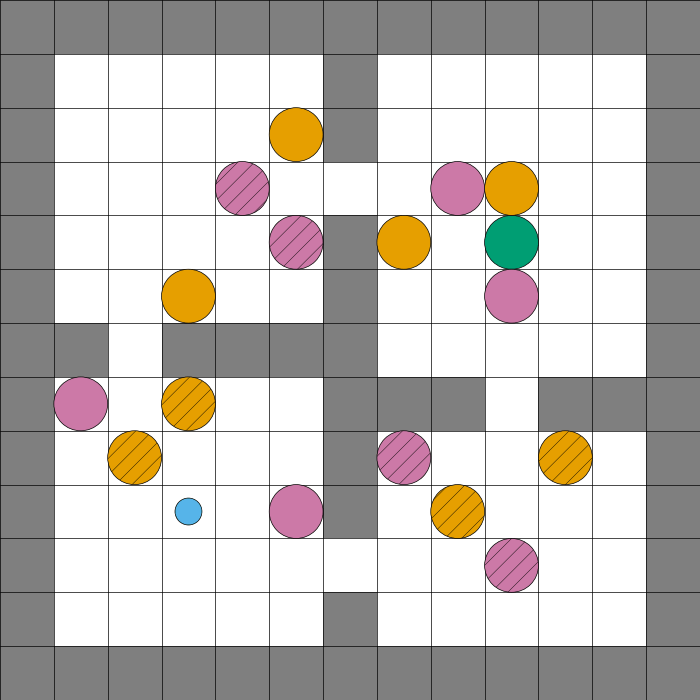

# ContGrid
Continuous space adaptation of grid-world envs in Gymnasium

## Environments
### RoomsEnv

A continuous 2D grid world where an agent must navigate through rooms to reach a goal while avoiding obstacles like lava and holes. The agent can move continuously in the environment and receives rewards for reaching the goal and penalties for hitting obstacles or taking steps.

