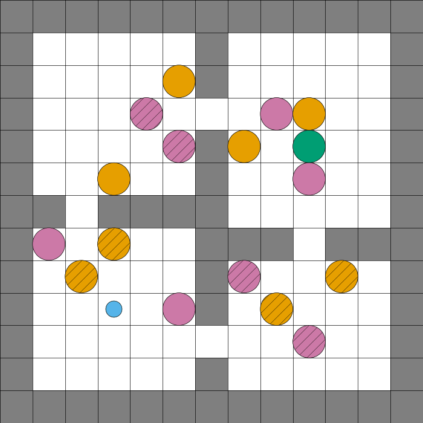

# ContGrid
Continuous space adaptation of grid-world envs in Gymnasium

**Performance:** This environment uses **Rust** 🦀 acceleration for ultra-fast wall collision detection, providing up to 650x speedup than Python (without rendering) in critical computation paths.

## Environments
### RoomsEnv

A continuous 2D grid world where an agent must navigate through rooms to reach a goal while avoiding obstacles like lava and holes. The agent can move continuously in the environment and receives rewards for reaching the goal and penalties for hitting obstacles or taking steps.



### PreyPredEnv

A continuous 15x15 navigation arena containing four distinct 4x4 regions with moving preys (goals) and moving predators (hazards). Designed for hierarchical reinforcement learning (HRL), option discovery (DFO/CPC), and temporal logic planning.

- **Dynamic Heuristics**: Deterministic patrols including linear oscillations, circular orbits, closed waypoint loops, and Lissajous figure-8s with strict boundary confinement and clearance enforcement ($c_{\min} \ge 0.8$).
- **Configurable Action Space**: Radial directional motion (`discrete_ang_directional` with 8 directions and 6 discrete speeds by default) or continuous velocity control.
- **Dual Task Modes**: Unordered set-capture with differentiated per-prey dictionary rewards (`capture_rewards: dict[int, float]`) and ordered reach-avoid sequential subtasks.
- **Pure State Observations**: Agent kinematics, ray-cast wall distances, relative prey/predator vectors, and edge-triggered capture counts.
- **Documentation**: See [docs/prey_pred.md](docs/prey_pred.md) for full specification.


```python
import gymnasium as gym
import contgrid

env = gym.make("contgrid/PreyPred-v0", render_mode="rgb_array")
obs, info = env.reset()
```
