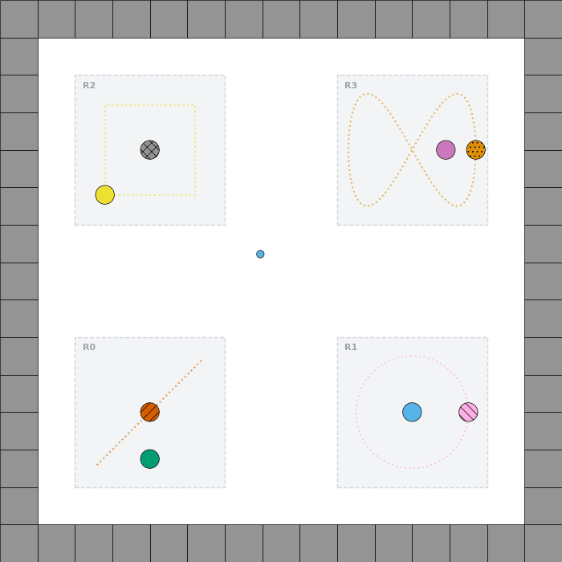

# Prey-Predator Environment (`contgrid/PreyPred-v0`)

The **Prey-Predator** (`PreyPredEnv`) environment is a continuous-space navigation benchmark in Gymnasium designed for hierarchical reinforcement learning (HRL), option discovery (such as Discovering Formal Options [DFO]), and compositional policy synthesis under temporal logic constraints.



---

## 1. Overview & Map Geometry

The environment features a continuous 15×15 unit grid bounded by unit-thickness perimeter walls (navigable domain: $x, y \in [0.5, 13.5]$). Inside this arena are **four 4×4 regions** (spaced 1 unit from outer walls and 3 units apart from each other):

| Region | Quadrant | Bounds ($x_{\min}, x_{\max}, y_{\min}, y_{\max}$) | Center $(x_c, y_c)$ | Default Configuration |
| :--- | :--- | :--- | :--- | :--- |
| **Region 0** | Bottom-Left | $[1.5, 5.5] \times [1.5, 5.5]$ | $(3.5, 3.5)$ | Fixed Prey, Horizontal Linear Patrol Predator |
| **Region 1** | Bottom-Right | $[8.5, 12.5] \times [1.5, 5.5]$ | $(10.5, 3.5)$ | Fixed Prey, Circular Orbit Predator |
| **Region 2** | Top-Left | $[1.5, 5.5] \times [8.5, 12.5]$ | $(3.5, 10.5)$ | Waypoint Patrol Prey, Fixed Predator |
| **Region 3** | Top-Right | $[8.5, 12.5] \times [8.5, 12.5]$ | $(10.5, 10.5)$ | Fixed Prey, Lissajous Figure-8 Predator |

Agent spawning is configured via `AgentSpawnConfig`:
- **`"neutral_corridor"`** (default): Spawns on neutral ground in the central corridors ($x \in [5.5, 8.5]$ or $y \in [5.5, 8.5]$).
- **`"random"`**: Spawns uniformly anywhere across the playable map while strictly avoiding walls and maintaining non-overlapping clearance from all preys and predators.
- **`"fixed"`**: Spawns at user-configured fixed coordinates (`fixed_pos`).

---

## 2. Entities & Movement Heuristics

There are **8 entities** total: 4 Preys ($p_0, p_1, p_2, p_3$) and 4 Predators ($q_0, q_1, q_2, q_3$), exactly one of each per region. In each region, one entity moves along a deterministic path while the other is stationary.

### Visual Distinctions
- **Preys (Goals)**: Color-coded circles ($r=0.4$):
  - $p_0$: `Green`
  - $p_1$: `Sky Blue`
  - $p_2$: `Yellow`
  - $p_3$: `Purple`
- **Predators (Hazards)**: Distinct threat colors and hatching patterns ($r=0.4$):
  - $q_0$: `Red` with diagonal hatch `///`
  - $q_1$: `Blue` with reverse hatch `\\\\`
  - $q_2$: `Grey` with cross hatch `xxx`
  - $q_3$: `Orange` with stipple hatch `...`

### Movement & Physical Mechanics
- **Proximity Trigger Zones (`collide=False`)**: Entities are modeled as trigger zones, avoiding physics pinballing or rigid-body glitches. Capture occurs when $\|p_{\text{agent}} - p_{\text{entity}}\| < r_{\text{agent}} + r_{\text{entity}}$.
- **Continuous Post-Capture State**: Entities remain active, visible, and moving throughout the entire episode. Predators remain lethal even after their region's prey is captured.
- **Default Speeds**: Moving preys and predators move at a default velocity of **$0.75$ m/s** (15% of the agent's maximum velocity of $5.0$ m/s).
- **Confinement & Clearance**:
  - Moving entities are strictly confined to their 4×4 region: $x \in [x_{\min} + r, x_{\max} - r]$ and $y \in [y_{\min} + r, y_{\max} - r]$.
  - Clearance between prey and predator in the same region is strictly maintained: surface-to-surface gap $c_{\text{gap}} \ge 0.40$ m (center distance $\|p_{\text{prey}} - p_{\text{predator}}\| \ge r_{\text{prey}} + r_{\text{predator}} + c_{\text{gap}} = 1.20$ m).

---

## 3. Action Space

Controlled via `action_config: ActionModeConfig`.

The default action mode is **`discrete_ang_directional`** (`MultiDiscrete([8, 6])`):
- `action[0] \in {0, ..., 7}`: 8 radial directional angles ($0^\circ, 45^\circ, 90^\circ, \dots, 315^\circ$).
- `action[1] \in {0, ..., 5}`: 6 discrete speed levels scaled up to $u_{\text{range}} = 5.0$ m/s.

---

## 4. Observation Space

Pure spatial-kinematic observation dictionary without task identity leakage:

| Key | Space | Description |
| :--- | :--- | :--- |
| `agent_pos` | `Box((2,), float64)` | Absolute $(x, y)$ coordinates of agent |
| `agent_vel` | `Box((2,), float64)` | Agent velocity $(\dot{x}, \dot{y})$ |
| `wall_dist` | `Box((4,), float64)` | Cardinal distances to blocking walls: [top, right, bottom, left] |
| `prey_rel_pos` | `Box((4, 2), float64)` | Relative positions of all 4 preys: $(p_{p_i} - p_{\text{agent}})$ |
| `prey_rel_vel` | `Box((4, 2), float64)` | Relative velocities of all 4 preys: $(v_{p_i} - v_{\text{agent}})$ |
| `predator_rel_pos`| `Box((4, 2), float64)` | Relative positions of all 4 predators: $(p_{q_i} - p_{\text{agent}})$ |
| `predator_rel_vel`| `Box((4, 2), float64)` | Relative velocities of all 4 predators: $(v_{q_i} - v_{\text{agent}})$ |
| `prey_capture_counts`| `Box((4,), int32)` | Edge-triggered visitation counts for each prey |

---

## 5. Task Configurations & Reward Dispatch

Task configurations are polymorphic discriminated unions (`TaskConfig`):

### 5.1 Unordered Task Mode (`UnorderedTaskConfig`)
Capture a set of required preys in any order:
```python
from contgrid.envs.prey_pred import UnorderedTaskConfig

task = UnorderedTaskConfig(
    required_preys=[0, 1, 2, 3],
    capture_rewards={0: 10.0, 1: 25.0, 2: 10.0, 3: 50.0},  # Differentiated prey rewards
    completion_reward=100.0,
    predator_penalty=-1.0,
    predator_absorbing=True,
    step_penalty=0.005,
)
```
- **Milestone Rewards**: Entering an uncaptured prey awards its milestone reward from `capture_rewards`. Subsequent re-entries increment `prey_capture_counts` but grant 0 reward.
- **Completion**: Once all required preys have count $\ge 1$, `completion_reward` is granted, `is_success = True`, and the episode terminates.

### 5.2 Ordered Task Mode (`OrderedTaskConfig`)
Sequential reach-avoid subtasks:
```python
from contgrid.envs.prey_pred import OrderedTaskConfig, PreyPredSubtaskConfig

task = OrderedTaskConfig(
    subtask_seq=[
        PreyPredSubtaskConfig(target_prey=0, avoid_predators=[0], reward=10.0),
        PreyPredSubtaskConfig(target_prey=2, avoid_predators=[2], reward=20.0),
    ],
    completion_reward=100.0,
)
```

---

## 6. Quickstart Usage

```python
import gymnasium as gym
import contgrid

# Create environment with animated rendering
env = gym.make("contgrid/PreyPred-v0", render_mode="rgb_array")
obs, info = env.reset(seed=42)

for step in range(100):
    action = env.action_space.sample()
    obs, reward, terminated, truncated, info = env.step(action)
    if terminated or truncated:
        break

env.close()
```
